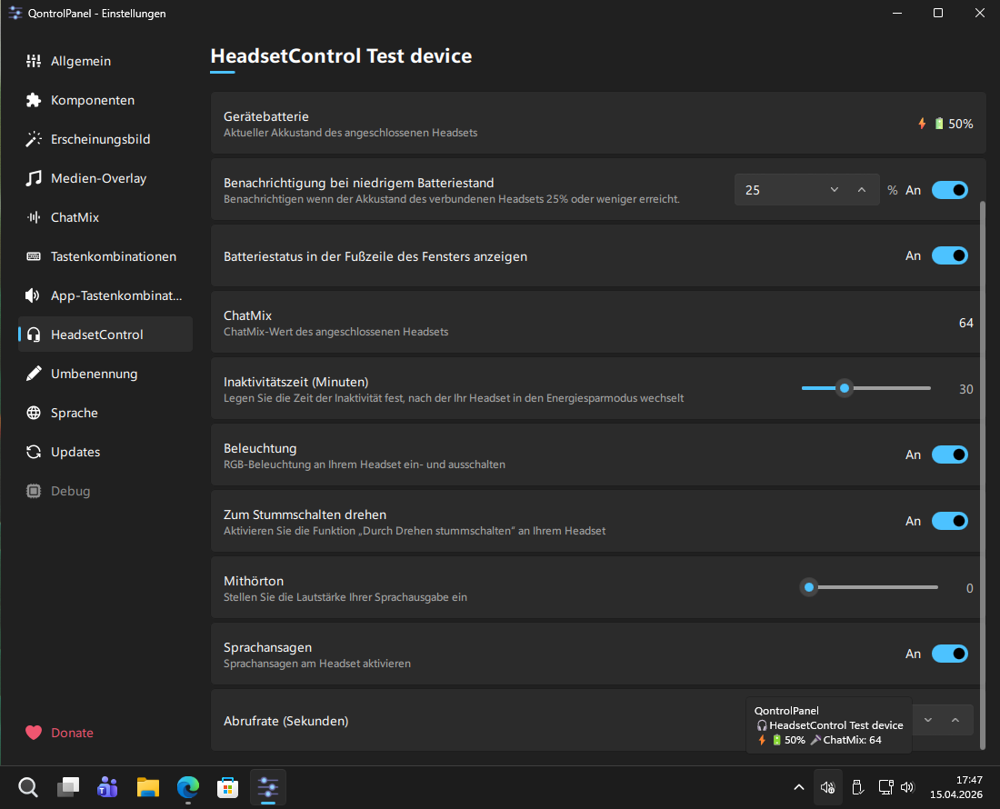

# QontrolPanel

QontrolPanel is an enhanced audio panel for Windows.  
It provide output and input volume / device / mute control as well as application volume mixer.

## HeadsetControl integration

For a list of supported headsets visit [here](https://github.com/Sapd/HeadsetControl).

If you like my work, please consider supporting me !

## Usage

Left click on the tray icon to reveal the panel. 
Click anywhere or left again on the tray icon to close the panel. 
Double click on tray icon will open the settings pane. 
Default section of settings pane is configurable in General section.

## Translations

Translators should have a look [here](.github/TRANSLATIONS.md).

## Installation

### Winget

`winget install ChrisLauinger77.QontrolPanel`

### Manual

Download latest version [here](https://github.com/ChrisLauinger77/QontrolPanel/releases/latest).  
Use the provided installer or download the archive, extract it, and run `bin/QontrolPanel.exe`.

## Build the project

See [here](.github/BUILDING.md).

## Credits

- [Odizinne](https://github.com/Odizinne) for [this great tool I forked](https://github.com/Odizinne/QontrolPanel) and try to keep alive
- Used OCEAN sound effects from KDE
- Used icons from FlatIcon and VeryIcon
- Application icon from [Yogi Aprelliyanto](https://www.flaticon.com/authors/yogi-aprelliyanto)
- [Sapd](https://github.com/sapd/) for [HeadsetControl](https://github.com/Sapd/HeadsetControl)
